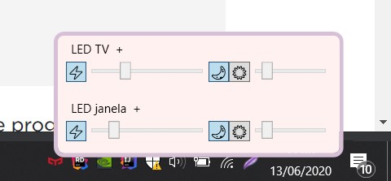

# Yeelight Remote Control
This utility controls Yeelight/Xiaomi LED Lights. It can be accessed in the Windows system tray.

Runs only on Windows.

Thanks to [roddone/YeelightAPI](https://github.com/roddone/YeelightAPI). 

**[Contribute](https://paypal.me/lsoares1)**

## Features
(only tested with Ceiling LEDs)

Per led:
- Turn on/off
- Set brightness
- Switch between Normal/Moonlight mode
- Set temperature
- Set LED name

General:
- Turn all leds on/off

## Building
1. Install [.NET Core SDK](https://dotnet.microsoft.com/download)
1. git clone this project
1. Run: `dotnet build`
1. Go to `\bin\Release\netcoreapp3.1`

## Running
1. Make sure [dev mode is enabled](https://www.yeelight.com/faqs/lan_control) per LED
1. Open the executable
1. Check in the system tray

### Other
- PRs are welcome
- Ongoing development (next feature is to auto turn-on with night based on the sunset).
